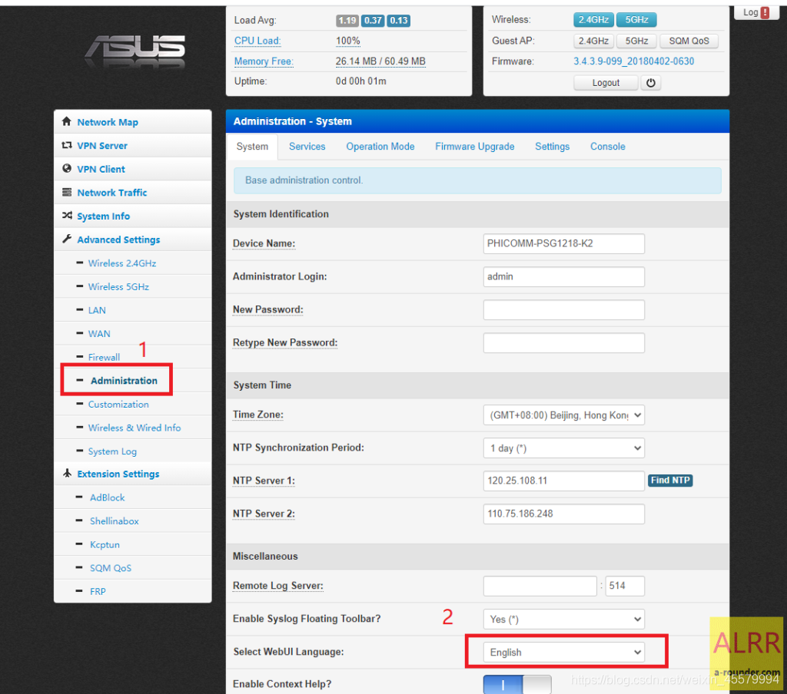
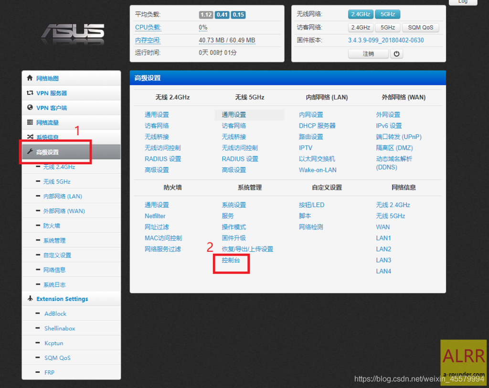
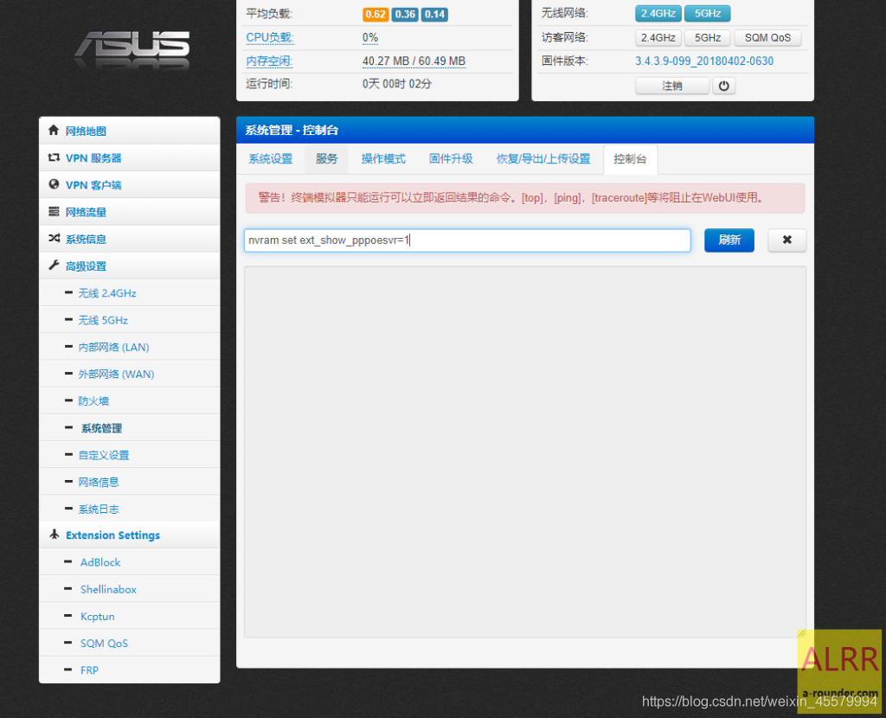
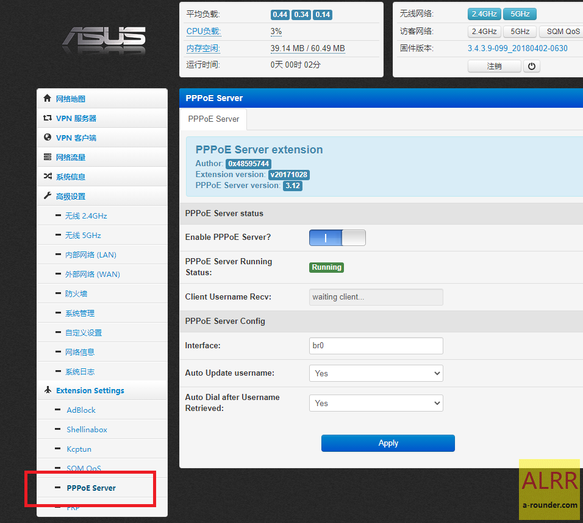

# 路由器:
1g  
斐讯 K2  
荒野无灯固件  

# 操作:

下载:  
[路由器刷breed web控制台助手](breed.zip)  
[荒野无灯固件PSG1218-K2_3.4.3.9-099_20181019-1049](PSG1218-K2_3.4.3.9-099_20181019-1049.trx)  

#### 1.刷breed
路由器通电源,用网线将路由器的`LAN`口(非黄色的)和电脑连接,然后运行上面软件一键操作刷入Breed (除了太高的版本,正常都能一键刷,刷不了的估计只能拆机刷)

#### 2.显示刷入成功后,拔掉路由器电源,按住路由器后面电源插孔旁的`Reset键`不放,插入电源,继续按住保持3秒松开
电脑打开浏览器地址栏输入`192.168.1.1` 回车,然后操作左边有个恢复出厂设置,选择`公版`,重置后.左边点`固件更新`,在固件那行点`选择文件`,将前面下载的荒野无灯固件`上传`,然后点`更新`,进度跳跑完以后,等待路由器启动,路由器指示灯变为`黄色`.

#### 3.电脑打开浏览器,地址栏输入 `192.168.2.1` ,跳出登录框,默认账号密码都是 `admin`

输入 `nvram set ext_show_pppoesvr=1`,点右边的闪讯

