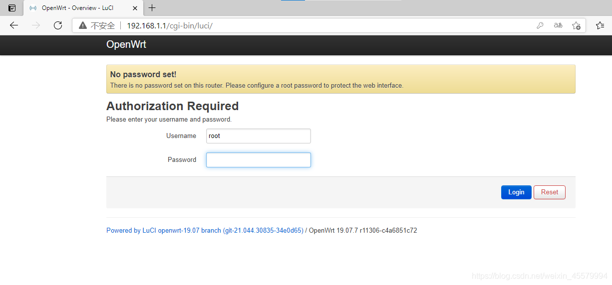
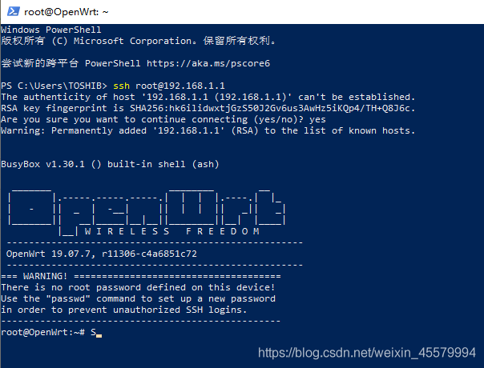
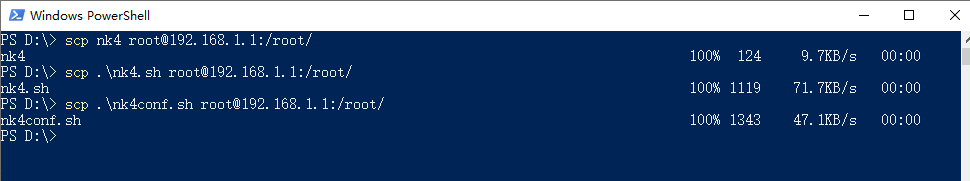
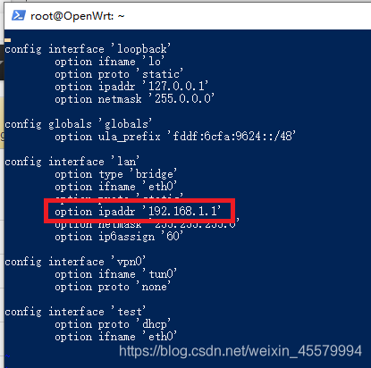

# 路由器:
1g1  
斐讯 K2  
openWrt 19.07.7  

# 1.下载固件准备
#### (1) [固件下载](openwrt-19.07.7-ramips-mt7620-psg1218a-squashfs-sysupgrade.bin)

#### (2) 上传固件: 略
管理地址: 192.168.1.1
初始无密码,直接登录



#### (3) 路由器需要有网(WAN口联网),方便用opkg安装中文包. 当然你也可以自己下载再上传到路由器上或者就用英文的

###### [1] 打开PowerShell,执行命令连接
```bash
ssh root@192.168.1.1
```


###### [2] [换源点我](https://blog.csdn.net/weixin_45579994/article/details/112381181)

更新索引
```bash
opkg update
```

###### [3] 安装中文语言包
```bash
opkg install luci-i18n-base-zh-cn
```

# 2.配置闪讯
#### (1) [下载脚本](https://yunpan.360.cn/surl_yRFuqJCbmAk) （提取码：a5ad）
#### (2) 可以使用Windows的scp命令把三个文件传到路由器的 /root 下
```bash
scp [要上传的文件路径] root@192.168.1.1:/root/
```


#### (3) 安装pppoe server
```bash
opkg install rp-pppoe-server
```

#### (4) 运行
```bash
sh /root/nk4conf.sh
```
# 3.修改网关 - 改路由器管理页面地址
统一改为 `192.168.6.1`

原因: 我测试环境下,多个路由器串着同网,避免冲突

ssh连接到路由器后
```bash
ssh root@192.168.1.1
```

修改配置文件
```bash
vim /etc/config/network
```

把 `lan` 下 `option ipaddr` 后面单引号中的IP改为 192.168.6.1

