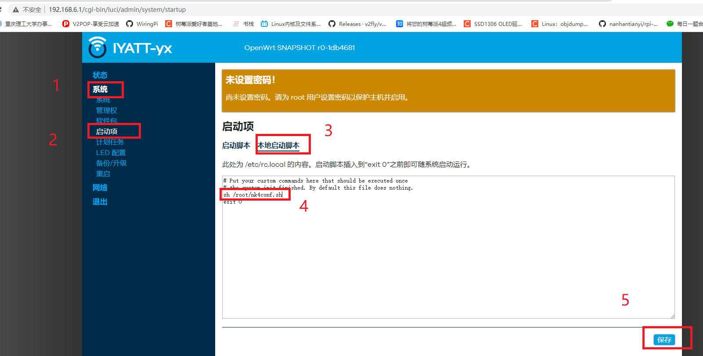
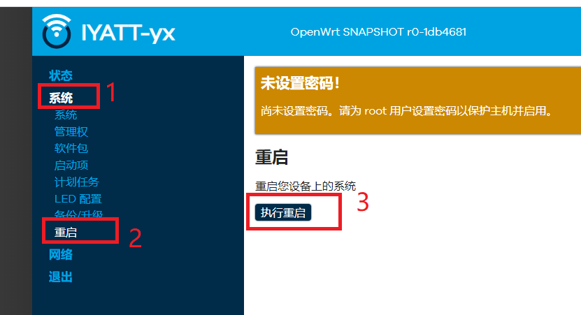

# 2.1g1
本固件已经内置捕获账号密码的脚本  

[newifi3](openwrt-ramips-mt7621-d-team_newifi-d2-squashfs-sysupgrade.bin)  

登录管理页面 `192.168.6.1`  

登录后,按图操作,第4步输入命令 `sh /root/nk4conf.sh`  

重启路由器  
  

然后打开上上步操作的地方删除那行命令,再保存
